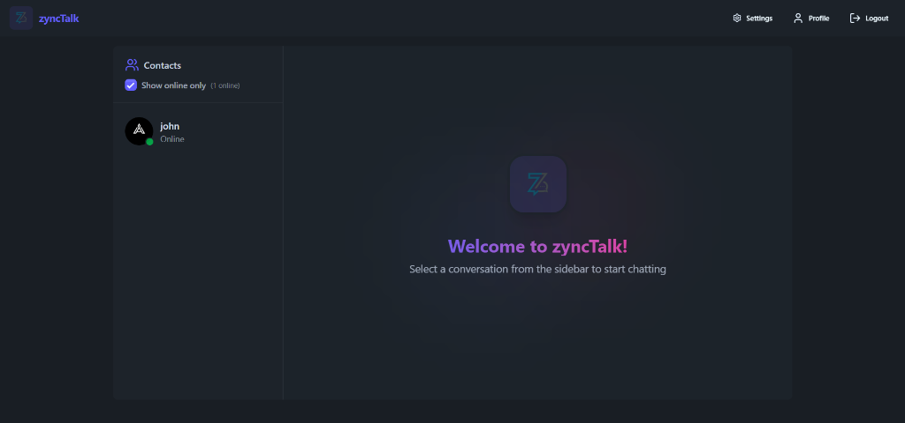
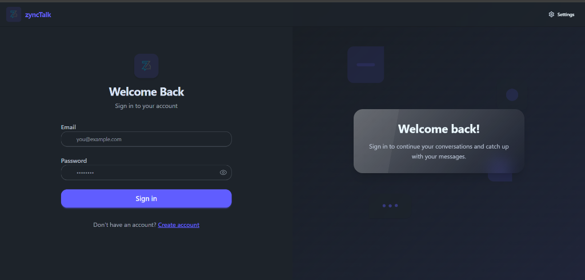
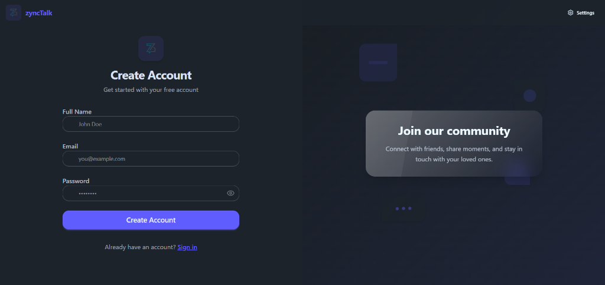
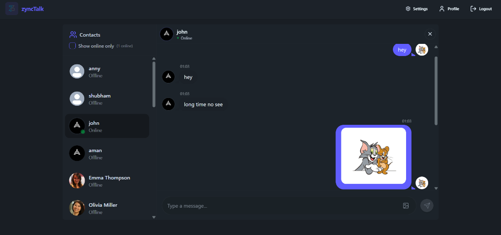
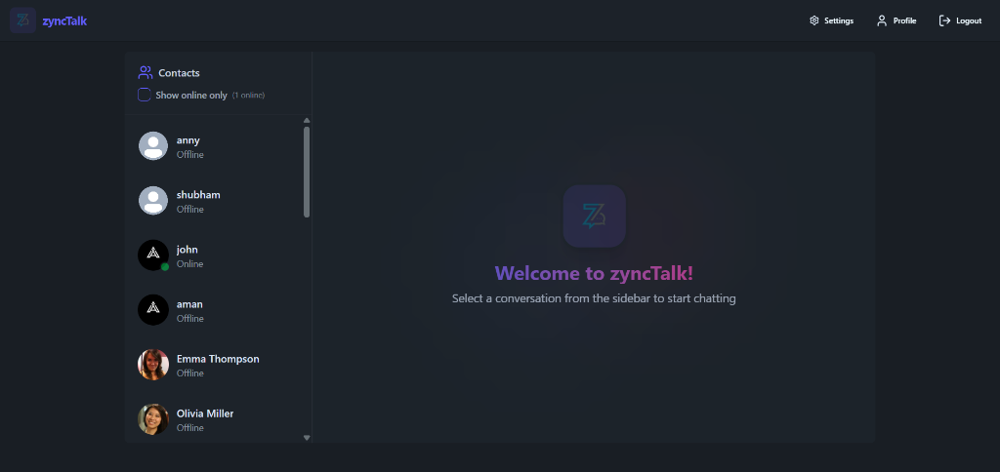
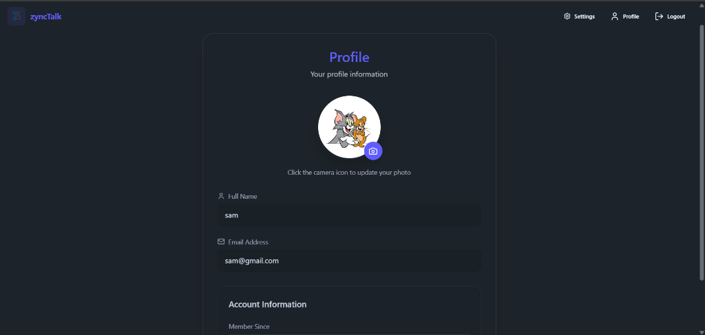
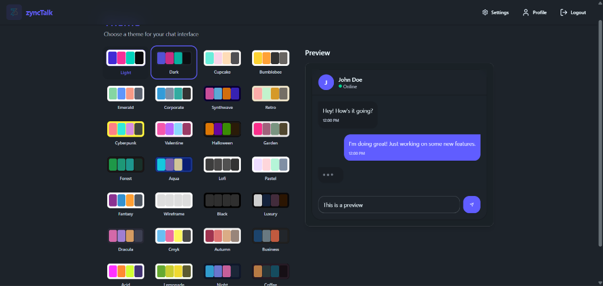

# zyncTalk - Real-time Chat Application

A modern, responsive, and feature-rich real-time chat application built with the MERN stack (MongoDB, Express, React, Node.js) and Socket.io.

---

### 🌟 **Tech Stack Highlight**
**MERN Stack** (MongoDB, Express, React, Node.js) + **Socket.io** + **TailwindCSS** + **Daisy UI** + **Docker**

#### **Core Highlights**
*   🔐 **Secure Authentication & Authorization**: Robust user access control implemented using **JSON Web Tokens (JWT)** and secure password hashing.
*   ⚡ **Real-time Messaging**: Seamless, low-latency bidirectional communication powered by **Socket.io**.
*   🟢 **Live Presence Tracking**: Dynamic online/offline status indicators reflecting real-time user connectivity.
*   📦 **Scalable State Management**: Optimized global state handling with **Zustand** for a reactive and high-performance UI.
*   🛠️ **Comprehensive Error Handling**: Structured validation and proactive error management across both the server and client.
*   🚦 **Granular Login Protection**: Advanced brute-force protection implemented specifically for the login endpoint using **express-rate-limit**.
*   🛡️ **Advanced Security**: Utilizing **Helmet.js** to enforce secure HTTP headers and protect the application from common web vulnerabilities.
*   🐳 **Containerization**: Fully dockerized environment with **Docker Compose** for seamless deployment and environment isolation.

---

## Key Features

*   **Real-time Messaging**: Instant messaging powered by Socket.io.
*   **Secure Authentication**: Robust user signup and login system using JWT (JSON Web Tokens) and bcrypt.
*   **Modern UI/UX**: Sleek, glassmorphic design built with Tailwind CSS and DaisyUI.
*   **Responsive Layout**: Optimized for all devices:
    *   **Desktop**: Full expanded view with sidebar and chat window.
    *   **Tablet**: Smart "Compact" sidebar with icon-only view.
    *   **Mobile**: "Sandwich" layout toggling between contact list and chat view.
*   **Online Presence**: Real-time online/offline status indicators for users.
*   **Multimedia Support**: Send and receive images in chats.
*   **Theme & Customization**: Support for multiple themes and clean aesthetics.

## Tech Stack

**Frontend:**
*   React.js
*   Vite
*   Tailwind CSS
*   DaisyUI
*   Zustand (State Management)
*   Lucide React (Icons)

**Backend:**
*   Node.js
*   Express.js
*   MongoDB (Mongoose)
*   Socket.io (Real-time communication)
*   Helmet (Security headers)
*   Express Rate Limit (API protection)
*   Cookie Parser

**DevOps & Deployment:**
*   Docker
*   Docker Compose
*   Nginx (Production Frontend Server)


## Screenshots

### Welcome & Login



### Sign Up


### Chat Interface


### Compact Sidebar (Tablets/Smaller Screens)


### Profile & Settings



## Getting Started

### Prerequisites
*   Node.js (v14 or higher)
*   MongoDB (Local or Atlas connection string)

### Installation

1.  **Clone the repository**
    ```bash
    git clone <repository_url>
    cd CHAT-APP
    ```

2.  **Setup Backend**
    ```bash
    cd backend
    npm install
    # Create a .env file with:
    # PORT=5001
    # MONGODB_URI=your_mongodb_uri
    # JWT_SECRET=your_jwt_secret
    # NODE_ENV=development
    npm run dev
    ```

3.  **Setup Frontend**
    ```bash
    cd ../frontend
    npm install
    npm run dev
    ```

4.  **Access the App**
    Open your browser and navigate to `http://localhost:5173` (or the port shown in your terminal).

### Running with Docker

1.  **Ensure Docker & Docker Compose are installed.**
2.  **Configure environment variables** in the `docker-compose.yml` file.
3.  **Build and run the containers:**
    ```bash
    docker-compose up --build
    ```
4.  **Access the App:**
    *   Frontend: `http://localhost:5173`
    *   Backend API: `http://localhost:5001`

## Security features
*   Password hashing with `bcryptjs`.
*   Protected routes with JWT authentication.
*   Secure HTTP headers with `helmet`.
*   API rate limiting with `express-rate-limit` (dedicated login protection).
*   CORS configuration for allowed origins.

## License
MIT
